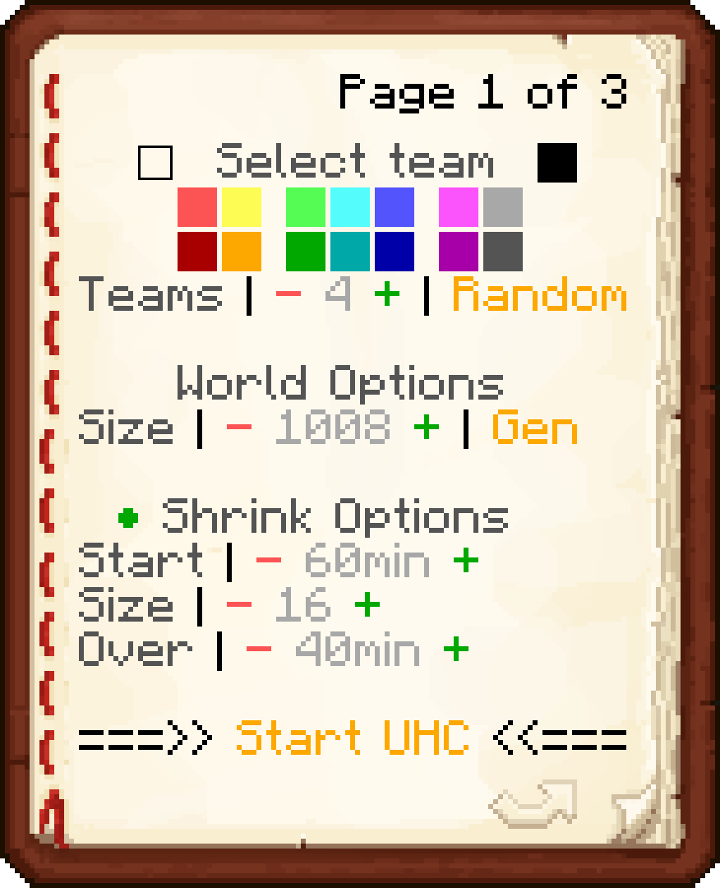
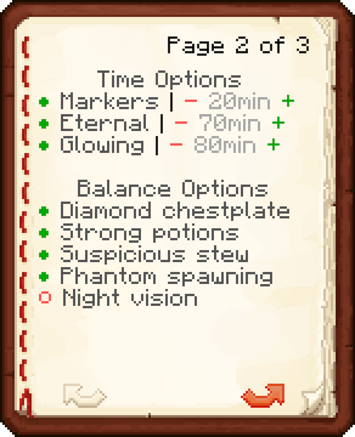
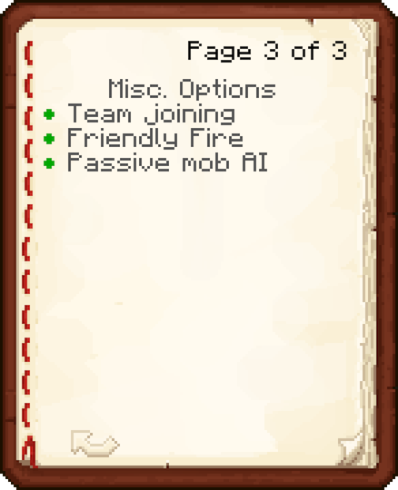

# UHC Pack for Minecraft Java Edition

A datapack for Minecraft Java Edition for running Ultra Hardcore (UHC) tournaments.

## Supported Minecraft versions

Currently supported Minecraft versions:

* 1.16.x
* 1.15.x

Earlier versions are not compatible due to the use of new command in the datapack. More
recent versions (including snapshots) may be compatible but are not actively supported
until a stable release is available.

The datapack has also officially supported on the following server variants:

* Vanilla
* Spigot
* Paper

## How to setup

1. Download the zip file for the [latest release](https://github.com/DrHenchman/uhc-pack/releases/download/v0.26/uhc-pack.zip) of the datapack
2. Place the zip file in in the `<world>/datapacks/` folder
3. Run `/reload` (or `/minecraft:reload` on Spigot/Paper) on your server to detect the new datapack
4. Decide the center of your map and teleport to it e.g. `/tp @s 0 ~ 0`
5. Run `/function uhc_pack:setup` to prepare the Lobby

From here, you can control the rest of the setup from the book provided.

After the UHC has concluded, you can run `/function uhc_pack:complete` to put
everyone into spectator mode and lock in the awards. You can then reveal
the awards using `/function uhc_pack:awards/reveal`.

## Features

* *Team selection* - Allow players to select their own teams as well as allow for them to be randomized between a specified number of teams.
  Players can also choose to spectate only. Players who join after the game has started automatically spectate.
* *World configuration* - Pick from a number of world sizes, from 500-3K blocks wide. Chunks can also be pre-generated to avoid lag during gameplay.
  To encourage combat, you can also configure a shrinking border with control over when it starts shrinking, the duration it shrinks for and the
  eventual border size.
* *Minute markers* - To help keep track of time, minute markers can be configured.
* *Late game options* - Encourage teams to engage in PVP by triggering external day and glowing effects.
* *Buffs and Nerfs* - Control the balance of your UHC using toggles for whether strong potions or suspicious stews are allowed.
* *Extensible* - Event triggers are available to allow other datapacks to plugin to UHC to further customize the experience.

### Configuration options

## Contributing

UHC Pack is developed open source and is happy to accept contributions. All contributions are made under the same
AGPL 3.0 license as UHC Pack uses. You are also welcome to raise bugs reports or enhancement requests if you have
any. For more information on contributing, refer to the guide in [CONTRIBUTING.md](CONTRIBUTING.md).

## Links

* [Bugs & Feature requests](https://github.com/DrHenchman/uhc-pack/issues)
* [Release notes](https://github.com/DrHenchman/uhc-pack/releases)
* [Discord server](https://discord.gg/PFg4mbN)

## Credits

* DrHenchman - Creator of the datapack
* [Contributors](https://github.com/DrHenchman/uhc-pack/graphs/contributors)

## License

UHC Pack - Ultra Hardcore for Minecraft Java Edition
Copyright (C) 2020  DrHenchman

This program is free software: you can redistribute it and/or modify
it under the terms of the GNU Affero General Public License as published by
the Free Software Foundation, either version 3 of the License, or
(at your option) any later version.

This program is distributed in the hope that it will be useful,
but WITHOUT ANY WARRANTY; without even the implied warranty of
MERCHANTABILITY or FITNESS FOR A PARTICULAR PURPOSE.  See the
GNU Affero General Public License for more details.

You should have received a copy of the GNU Affero General Public License
along with this program.  If not, see <https://www.gnu.org/licenses/>.
